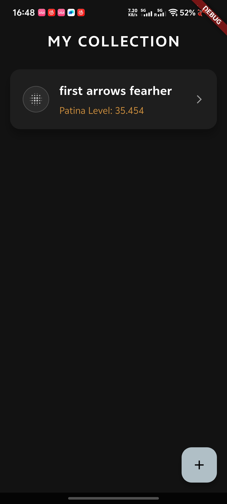
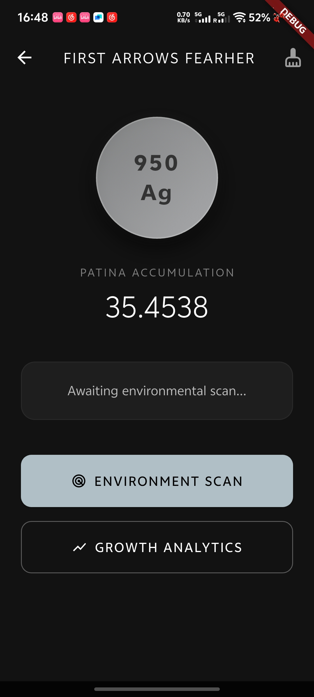
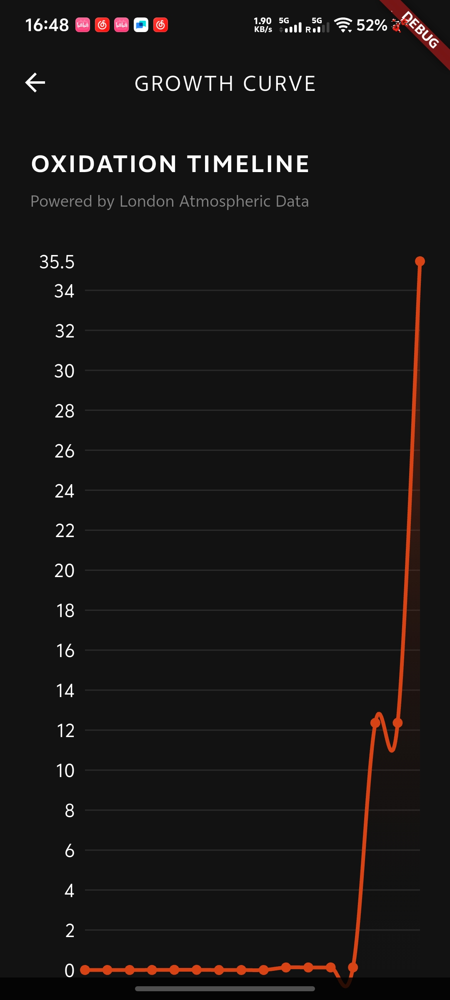

# Digital Patina Sensor 

Welcome to the **Digital Patina Sensor** repository. This is the final assessment project for the CASA0015 Mobile Systems and Interactions module at University College London (UCL). 

Digital Patina is an innovative Connected Environments mobile application built with Flutter. It acts as a digital inventory and oxidation tracker for 950 silver jewelry. By intercepting live atmospheric data (Humidity and SO2 levels) via APIs, the app simulates the highly realistic, slow-paced sulfation process of physical silver over time using a physics-based algorithm.

---

## App Demonstration Video

---

## User Personas & Storyboarding

### The Problem
Traditional silver jewelry enthusiasts often lose track of how their environment affects the aging and patina of their pieces. There is a disconnect between the physical degradation of the material and digital tracking.

### User Persona
**Target Audience:** Amekaji fashion enthusiasts and high-end silver jewelry collectors. 
**User Needs:** They need a way to digitally catalogue their collection, track the oxidation level of each piece based on the real-world environment they are exposed to (e.g., the humidity and pollution levels in London), and know when a piece might need polishing.

### User Journey & Storyboarding
1. **Onboarding:** The user opens the app and lands on the "My Collection" inventory screen.
2. **Cataloging:** The user clicks the '+' button to register a new 950 silver feather or bangle.
3. **Tracking :** As the user walks through London, the app silently fetches live GPS and weather/SO2 data, calculating the oxidation increment. The user can also trigger a "Manual Environment Scan".
4. **Visual Feedback:** The digital silver badge slowly transitions from bright silver to an oxidized dark metallic shade.
5. **Analytics:** The user views the "Growth Analytics" chart to see the historical accumulation of patina.

---

## Application Screenshots & Walkthrough

Below is a visual walkthrough of the application's core features:

### 1. The Inventory (My Collection)
Users can view all their tracked silver items at a glance, showing the current patina level.

### 2. The Patina Dashboard (Live IoT Tracking)
The core dashboard where the digital silver badge visually degrades based on environmental API data. Users can manually trigger a scan or polish the item.

### 3. Growth Analytics (Data Visualization)
A real-time data visualization screen pulling historical accumulation logs directly from Firebase Firestore.

---

## How to Install and Run the App

If you are a developer looking to test or contribute to this project, please follow the instructions below:

### Prerequisites
- **Flutter SDK:** Version 3.19.0 or higher
- **Dart:** Version 3.3.0 or higher
- **IDE:** VS Code or Android Studio with Flutter extensions installed.
- **Firebase:** You will need your own `google-services.json` (Android) / `GoogleService-Info.plist` (iOS) configured for Firestore.

### Installation Steps
1. Clone the repository:
`git clone https://github.com/malus-eng/casa0015-patina-engine`

2. Navigate to the project directory:
`cd casa0015-patina-engine`

3. Fetch the required Flutter packages:
`flutter pub get`

4. Run the application on a connected device or emulator:
`flutter run`

### Core Dependencies Used
- `cloud_firestore`: For cloud database and historical logging.
- `fl_chart`: For rendering the patina growth curve.
- `workmanager`: For background IoT automation (fetching weather data silently).
- `geolocator` & `http`: For GPS positioning and OpenWeather API integration.

---

## Contact Details

**Developer:** Qingshan Luo
**Course:** CASA0015 Mobile Systems and Interactions  
**Institution:** University College London (UCL)  
**GitHub:** https://github.com/malus-eng

*Feel free to reach out if you have any questions about the physics algorithm or the Flutter implementation!*